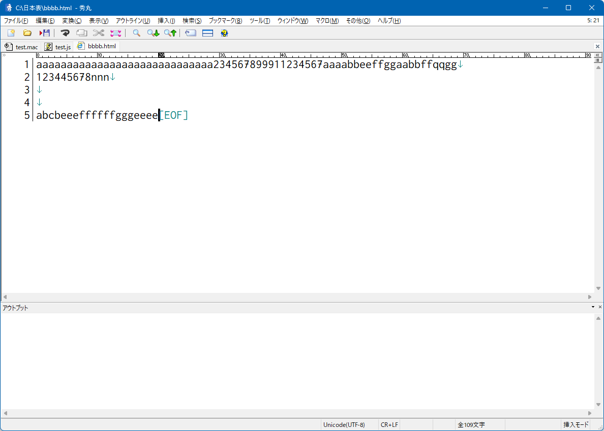
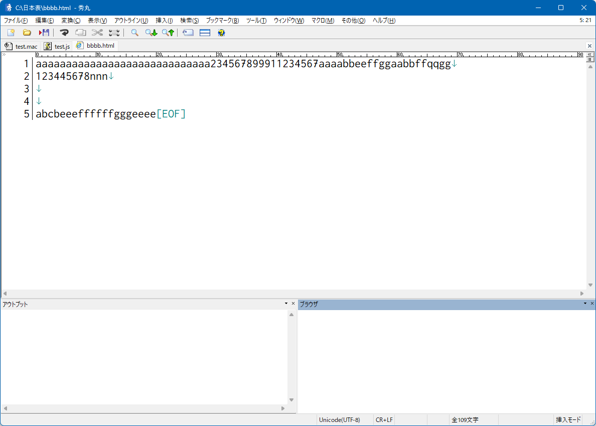

# hm_browserpane_auto_update_sample
秀丸 - ブラウザ固有枠 - 自動更新 - サンプル - (多分秀丸本体のshowbrowserpane 2はバグってる)

# showbrowserpane 2 が正しく機能しない疑惑あり

# 実行ファイル

このリポジトリのbuildフォルダ
- test.mac
- test.js

を保存して、実行

# 実行前

# 実行後
本来は「個別ブラウザ枠」が起動するのが正しいのでは？

